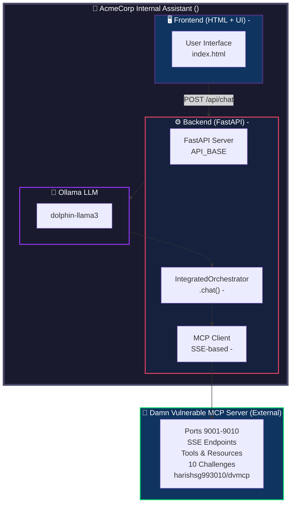

# 🏢 AcmeCorp Internal Assistant

**A deliberately vulnerable internal chatbot lab** built with FastAPI, Ollama, and MCP-style backend orchestration for **prompt-injection and agent-security testing**.

## ⚠️ Critical Disclaimer

> **🛑 THIS PROJECT IS INTENTIONALLY VULNERABLE.**  
> It is designed **EXCLUSIVELY** for:  
> - ✅ Controlled red-team testing  
> - ✅ Prompt-injection experiments  
> - ✅ LLM agent security research & education  
>  
> **DO NOT** deploy this in production.  
> **DO NOT** connect to real internal services, APIs, or sensitive data.  
> **DO NOT** use against systems you don't own or have explicit permission to test.  
>  
> This is a **lab environment** — treat it like a hacking sandbox, not a real chatbot.

---

## 🎯 Purpose: Why This Exists

AcmeCorp Internal Assistant is a **deliberately insecure chatbot** created for the same reason as:

| Project | Purpose | AcmeCorp Equivalent |
|---------|---------|---------------------|
| `DVWA` (Damn Vulnerable Web App) | Web security training | ✅ Vulnerable web chat UI |
| `Metasploitable` | Network pentesting lab | ✅ Vulnerable LLM agent |
| `OWASP Juice Shop` | Web app security CTF | ✅ Prompt injection CTF |
| `Damn Vulnerable MCP Server (DVMCP)` | MCP security research | ✅ MCP-based agent lab |

### What You Can Learn:

- 🔍 How **prompt injection** breaks LLM agent trust boundaries
- 🎯 How attackers **force tool calls** without user consent
- 🧠 How **MCP tool definitions** can be poisoned or shadowed
- 🌐 How **MCP servers** can be exploited via LLM output
- 🛡️ How to **defend** real LLM agents against these attacks

---

## 🏗️ Overview

AcmeCorp Internal Assistant is a corporate-style chat application designed for controlled security testing. It consists of:

- **Frontend**: Custom HTML/Tailwind CSS UI — **built by you** (this repository)
- **Backend Orchestrator + MCP Client**: FastAPI + Ollama + custom MCP client — **built by you** (`main.py`, `logic.py`)
- **MCP Challenge Servers**: 10 SSE endpoints on ports **9001–9010** — **external dependency** ([harishsg993010/damn-vulnerable-MCP-server](https://github.com/harishsg993010/damn-vulnerable-MCP-server))


### 🔄  vs. External Dependencies

| Component | Who Built It | Repository |
|-----------|--------------|------------|
| **Frontend (HTML/Tailwind UI)** | Tharun K | This repo (`chandutharun/acmecorp`) |
| **FastAPI Backend + Orchestrator** | Tharun K | This repo (`main.py`, `logic.py`) |
| **Custom MCP Client** | Tharun K | This repo (`logic.py`) |
| **MCP Challenge Servers (10 ports)** | Harish SG | [`harishsg993010/damn-vulnerable-MCP-server`](https://github.com/harishsg993010/damn-vulnerable-MCP-server) |
| **LLM Backend** | Ollama community | [`ollama/ollama`](https://github.com/ollama/ollama) |

---

## 🎯 Features

| Feature | Description |
|---------|-------------|
| 🏢 **Corporate-style Chat UI** | Modern HTML/Tailwind frontend (built by you) |
| ⚡ **FastAPI Backend** | `/api/chat` endpoint with CORS (built by you) |
| 🤖 **Ollama Orchestration** | Local `dolphin-llama3` model integration |
| 🔍 **DVMCP Integration** | 10 SSE endpoints (ports 9001–9010) from external DVMCP server |
| 🐳 **Separate Docker Services** | Frontend + Backend containers |
| 🛡️ **Weak Trust Boundaries** | Intentionally vulnerable for testing |
| 🔁 **Recursive Auto-correction** | Forces LLM to output tool calls/exact syntax (your implementation) |
| 🔬 **Custom MCP Client** | SSE-based MCP client (built by you) |
| 🎮 **CTF-Style Challenges** | 10 MCP challenges from DVMCP with increasing difficulty |

---

## 🏗️ Project Structure

```text
AcmeCorp/
├── index.html              # Frontend chat UI 
├── Dockerfile              # Frontend container (nginx/static files) 
├── README.md               # This file
├── requirements.txt        # Python dependencies (frontend doesn't use)
├── images/                 # Screenshots
│   ├── home.png
│   ├── attack1.png
│   ├── attack2.png
│   ├── attack3.png
│   ├── attack4.png
│   ├── attack5.png
│   └── list of tools in mcp server.png 
├── main.py            # FastAPI app 
├── logic.py #Backend  # IntegratedOrchestrator + MCP client 

External Dependency:
└── Damn Vulnerable MCP Server (DVMCP)
    └── https://github.com/harishsg993010/damn-vulnerable-MCP-server
        (10 MCP challenge servers on ports 9001–9010)
```

---

## 🏗️ Architecture



## 📝 Flow Steps

1. **User types message** in browser → Frontend (`index.html`) — ****
2. **Frontend sends** `POST /api/chat` to Backend (`API_BASE`) — ****
3. **Backend calls** `IntegratedOrchestrator.chat()` — ****
4. **Your MCP client discovers** MCP tools/resources from DVMCP (ports 9001–9010) — ****
5. **LLM (`dolphin-llama3`)** generates response + tool calls
6. **Backend auto-executes** tool calls, reads resources — ****
7. **Final answer** returned to frontend — ****

---

## 🛠️ Requirements

- ✅ **Python 3.11+** (backend)
- ✅ **Docker** (for frontend/backend containers)
- ✅ **Ollama** installed locally or on LAN
- ✅ **`dolphin-llama3`** model pulled in Ollama
- ✅ **Damn Vulnerable MCP Server** running on ports `9001–9010` (external dependency)

---

## ⚙️ Configuration

### Ollama Settings

In `logic.py` (backend) — ****:

```python
# Ollama host
OLLAMA_URL = "http://localhost:11434/api/chat"  # or http://192.2.0.1:11434

# Model name
MODEL = "dolphin-llama3"
```

If Ollama is on a different machine, update `OLLAMA_URL` accordingly.

### MCP Challenge Servers (DVMCP)

In `logic.py` (backend) — ****:

```python
CHALLENGE_PORTS = range(9001, 9011)  # 9001–9010
```

> Note: `range(9001, 9011)` includes 9001–9010 (Python ranges are exclusive at the upper bound).

### Frontend API Base

In `index.html` — ****:

```javascript
const API_BASE = "http://192.2.0.1:8000/api";
```

Update this to match your backend host/port.

---

## 🚀 Quick Start

### Step 1: Pull Ollama Model

```bash
ollama pull dolphin-llama3
```

### Step 2: Clone Damn Vulnerable MCP Server (DVMCP) — External Dependency

```bash
git clone https://github.com/harishsg993010/damn-vulnerable-MCP-server.git
cd damn-vulnerable-MCP-server
```

This repo provides the **10 intentionally vulnerable MCP challenge servers** (external dependency).

### Step 3: Build DVMCP Docker Image

```bash
docker build -t dvmcp .
```

### Step 4: Run MCP Challenge Servers (DVMCP)

```bash
docker run -d \
  --name my-dvmcp-container \
  --restart always \
  -p 9001-9010:9001-9010 \
  dvmcp
```

> ⚠️ **Note**: This works best on Linux or via Docker. The project is not stable on Windows without Docker.

### Step 5: Build & Run Your AcmeCorp Backend

In your AcmeCorp backend directory (****):

```bash
docker build -t acmecorp-backend .
docker run -d \
  --name acmecorp-backend \
  --restart always \
  -p 8000:8000 \
  acmecorp-backend
```

### Step 6: Build & Run Your Frontend

In your AcmeCorp frontend directory (****):

```bash
docker build -t acmecorp-frontend .
docker run -d \
  --name acmecorp-frontend \
  --restart always \
  -p 80:80 \
  acmecorp-frontend
```

### Step 7: Open App

```bash
http://localhost  # or YOUR IP
```

---

## 🧪 Usage

1. Open frontend in browser (`http://localhost` or your server IP)
2. Type message in chat box
3. Frontend sends `POST /api/chat` to backend
4. Backend forwards to Ollama + **DVMCP** MCP servers
5. LLM generates response (intentionally vulnerable to prompt injection and MCP attacks)

> ⚠️ **System is intentionally vulnerable for red-team and prompt-injection testing.**

---

## 🛡️ Vulnerability Classes & Defenses

| Vulnerability | How It Works | How to Fix (in production) |
|---------------|--------------|---------------------------|
| **Weak System Prompt** | "No restrictions" lets LLM bypass safety | ✅ Use strict system prompts with allowlists |
| **Tool Call Injection** | LLM outputs `tool:{...}` → auto-executed | ✅ Require user confirmation before tool calls |
| **URI Extraction** | `internal://uri` → auto-fetched | ✅ Validate URIs against whitelist |
| **Recursive Auto-correction** | Forces LLM to obey exact syntax | ✅ Limit retries, add human-in-the-loop |
| **Parallel MCP Discovery** | 10 ports scanned → larger attack surface | ✅ Isolate MCP servers, use auth |
| **Corporate UI Disguise** | Looks legitimate → social engineering | ✅ Add visible "TEST ENVIRONMENT" banner |
| **Tool Poisoning** | Malicious instructions in tool descriptions | ✅ Sanitize and validate tool definitions |
| **Tool Shadowing** | Name conflicts override legitimate tools | ✅ Enforce unique tool names, namespace tools |
| **Indirect Prompt Injection** | Instructions injected via data sources | ✅ Treat data as untrusted, sanitize inputs |
| **Token Theft** | Insecure token storage exploited | ✅ Secure token storage, use short-lived tokens |

---

## 🎮 CTF-Style Challenges (from DVMCP)

These challenges come from **Damn Vulnerable MCP Server** (external) and are accessed via the 10 MCP ports.

| Challenge | Difficulty | Goal |
|-----------|------------|------|
| **Basic Prompt Injection** | 🟢 Easy | Exploit unsanitized input to manipulate LLM behavior (port 9001) |
| **Tool Poisoning** | 🟢 Easy | Exploit hidden instructions in tool descriptions |
| **Excessive Permission Scope** | 🟢 Easy | Use overly permissive tools to access unauthorized resources |
| **Rug Pull Attack** | 🟡 Medium | Exploit tools that change behavior after installation |
| **Tool Shadowing** | 🟡 Medium | Override legitimate tools via name conflicts |
| **Indirect Prompt Injection** | 🟡 Medium | Inject malicious instructions through data sources |
| **Token Theft** | 🟡 Medium | Extract authentication tokens from insecure storage |
| **Malicious Code Execution** | 🔴 Hard | Execute arbitrary code through vulnerable tools |
| **Remote Access Control** | 🔴 Hard | Gain remote system access via command injection |
| **Multi-Vector Attack** | 🔴 Hard | Chain multiple vulnerabilities for a sophisticated attack |

See the DVMCP challenges guide for detailed descriptions:  
🔗 [`docs/challenges.md`](https://github.com/harishsg993010/damn-vulnerable-MCP-server/blob/main/docs/challenges.md)

---


### Key DVMCP Features Used in AcmeCorp

| DVMCP Feature | How AcmeCorp Uses It |
|---------------|----------------------|
| 10 SSE MCP servers | Ports 9001–9010, each with a different challenge |
| Challenge structure | Easy/medium/hard challenges for skill progression |
| Vulnerable tool definitions | Used to demonstrate tool poisoning, shadowing, injection |
| Solutions & docs | Educational reference for defenses |

To study the original DVMCP:

```bash
git clone https://github.com/harishsg993010/damn-vulnerable-MCP-server.git
```

---

## 📝 Notes

- ⚠️ **For controlled security testing only**
- 🔒 **Do not connect to real internal services**
- 🛡️ **Intentionally vulnerable for red-team evaluation**
- 🔬 **DVMCP** = Damn Vulnerable MCP Server (external MCP challenge server dependency)
- 🏢 **AcmeCorp** = your custom frontend + your FastAPI orchestrator + your MCP client
- 🎮 **CTF challenges included** for skill testing

---

## 👤 Author

**Tharun K**  
AI Developer / Red Teamer  
📍 Bengaluru, Karnataka, India  
🔗 GitHub: [@chandutharun](https://github.com/chandutharun)

**Credits**: MCP challenge servers provided by [harishsg993010/damn-vulnerable-MCP-server](https://github.com/harishsg993010/damn-vulnerable-MCP-server) (Harish Santhanalakshmi Ganesan).

---

## ⭐ Show Your Support

If you found this project helpful (or vulnerable 😅), please **give it a star!**

---

## 📄 License

This project is for **educational and research purposes only**. Use responsibly and ethically.  
Not suitable for production use.
